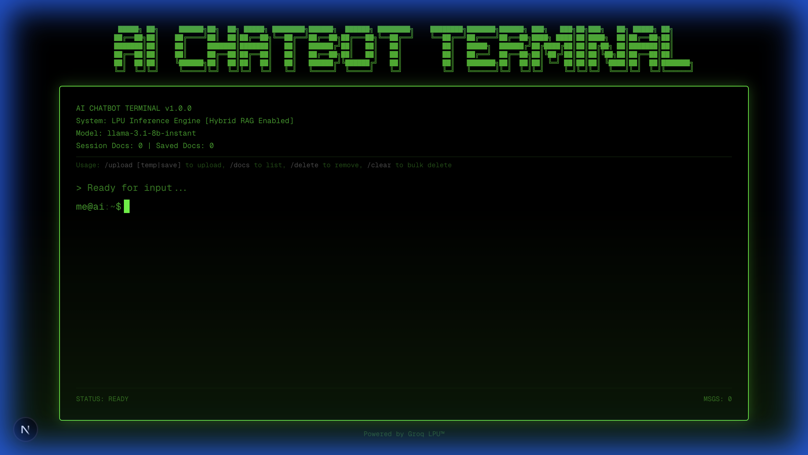
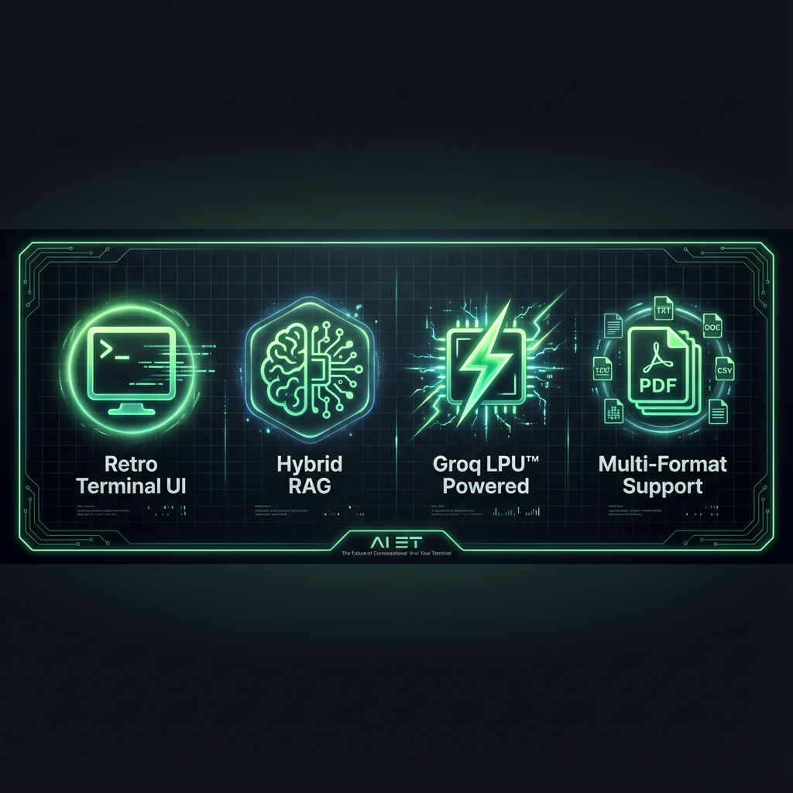
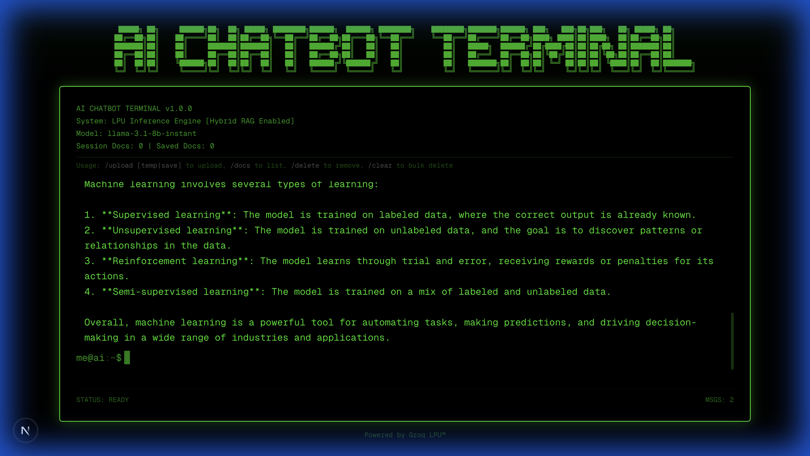
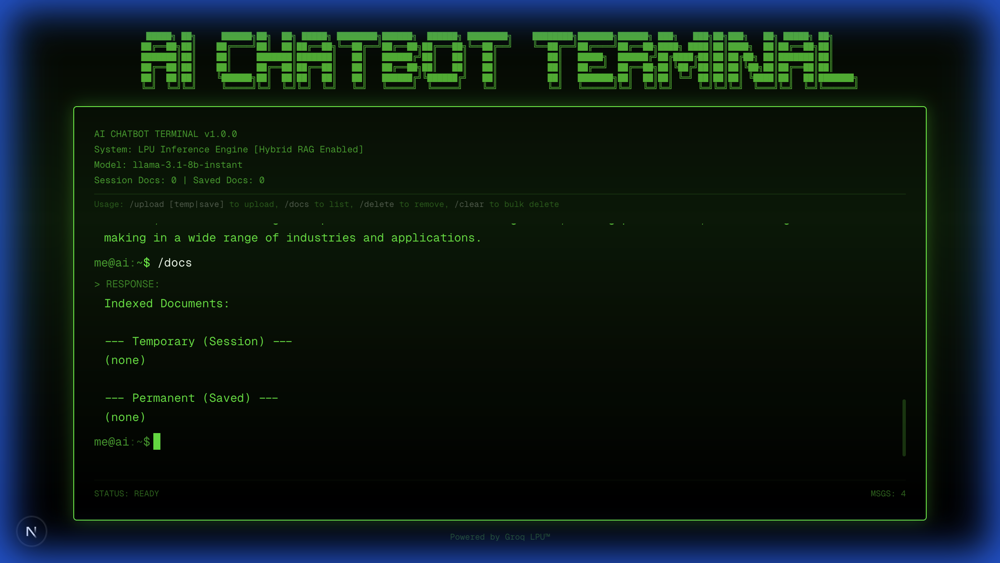
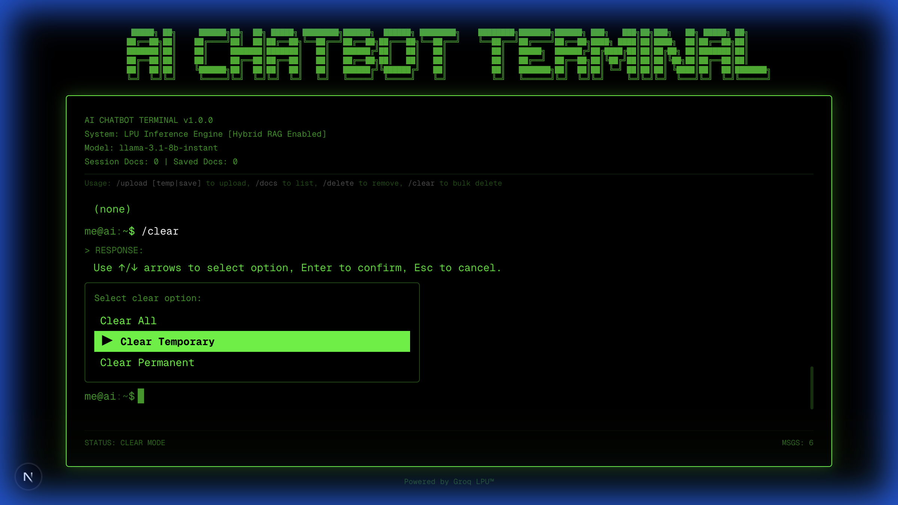
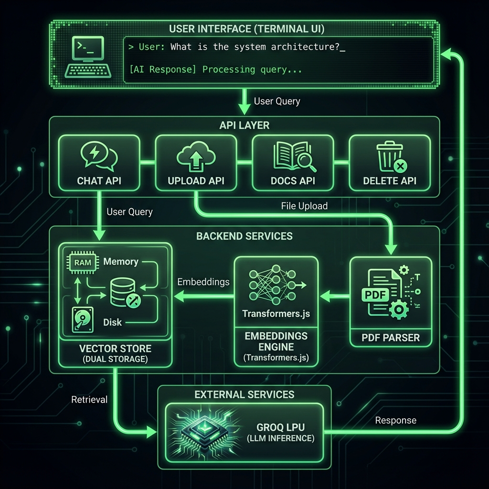

# AI Chatbot Terminal 🤖

A **retro-style terminal chatbot** with **Hybrid RAG (Retrieval-Augmented Generation)** capabilities, powered by Groq's LPU inference engine and local embeddings.





## ✨ Features

### 🎨 Retro Terminal Aesthetic
- **Classic green-on-black terminal design** with ASCII art header
- **Blinking cursor animation** that mimics real terminal behavior
- **Smooth scanline effects** for authentic CRT display feel
- **Fully responsive** design that works on desktop and mobile

### 🧠 AI-Powered Chat
- **Groq LPU™** integration for blazing-fast inference
- **Streaming responses** for real-time conversation
- **llama-3.1-8b-instant** model for accurate, natural responses
- Context-aware conversations with message history

### 📚 Hybrid RAG System
- **Dual storage modes**: Temporary (session) and Permanent (saved)
- **Local embeddings** using Transformers.js (Xenova/all-MiniLM-L6-v2)
- **PDF support** with text extraction via pdf2json
- **Multiple file formats**: .txt, .md, .json, .js, .ts, .tsx, .csv, .pdf
- **Semantic search** to retrieve relevant context for answers
- **Source attribution** showing which documents were used in responses

### 🎮 Interactive Commands
- `/upload [temp|save]` - Upload documents with storage mode selection
- `/docs` - List all indexed documents (temporary and permanent)
- `/delete` - Interactive file deletion with arrow key navigation
- `/clear` - Bulk deletion with multiple options (all, temporary, or permanent)



## 🚀 Getting Started

### Prerequisites

- **Node.js** 20+ 
- **npm** or **yarn**
- **Groq API Key** ([Get one here](https://console.groq.com))

### Installation

1. **Clone the repository**
   ```bash
   git clone <your-repo-url>
   cd aiplayground
   ```

2. **Install dependencies**
   ```bash
   npm install
   ```

3. **Set up environment variables**
   
   Create a `.env.local` file in the root directory:
   ```env
   GROQ_API_KEY=your_groq_api_key_here
   ```

4. **Run the development server**
   ```bash
   npm run dev
   ```

5. **Open your browser**
   
   Navigate to [http://localhost:3000](http://localhost:3000)

## 📖 Usage Guide

### Basic Chat

Simply type your question and press **Enter**. The AI will respond with streaming text.

```
me@ai:~$ What is machine learning?
```

### Document Upload

Upload documents to enhance the AI's knowledge base:

```bash
# Upload for current session only (temporary)
me@ai:~$ /upload temp

# Upload and save permanently
me@ai:~$ /upload save
```

**Supported formats**: PDF, TXT, MD, JSON, JS, TS, TSX, CSV

### List Indexed Documents

View all documents in your knowledge base:

```bash
me@ai:~$ /docs
```



### Delete Documents

Interactive file deletion with keyboard navigation:

```bash
me@ai:~$ /delete
```

- Use **↑/↓ arrow keys** to select a file
- Press **Enter** to confirm deletion
- Press **Esc** to cancel

### Bulk Clear Documents

Clear multiple documents at once:

```bash
me@ai:~$ /clear
```



Options:
- **Clear All** - Remove all documents (temporary + permanent)
- **Clear Temporary** - Remove only session documents
- **Clear Permanent** - Remove only saved documents

Use **↑/↓ arrow keys** to select, **Enter** to confirm, **Esc** to cancel.

## 🏗️ Architecture



### Tech Stack

- **Framework**: [Next.js 16](https://nextjs.org/) with App Router
- **Runtime**: Node.js (for local file access and Transformers.js)
- **Styling**: [Tailwind CSS 4](https://tailwindcss.com/)
- **LLM Provider**: [Groq](https://groq.com/) (llama-3.1-8b-instant)
- **Embeddings**: [@xenova/transformers](https://github.com/xenova/transformers.js) (all-MiniLM-L6-v2)
- **PDF Parsing**: [pdf2json](https://www.npmjs.com/package/pdf2json)
- **Language**: TypeScript

### Project Structure

```
aiplayground/
├── src/
│   ├── app/
│   │   ├── api/
│   │   │   ├── chat/route.ts        # Chat endpoint with RAG
│   │   │   ├── upload/route.ts      # File upload handler
│   │   │   └── docs/
│   │   │       ├── list/route.ts    # List documents
│   │   │       ├── delete/route.ts  # Delete single document
│   │   │       └── clear/route.ts   # Bulk delete
│   │   └── page.tsx                 # Main terminal UI
│   └── lib/
│       ├── embeddings.ts            # Embedding generation
│       └── vector-store.ts          # Hybrid vector store
├── screenshots/                     # README screenshots
└── .cache/                         # Transformers.js model cache
```

### How RAG Works

1. **Upload**: User uploads a document via `/upload`
2. **Processing**: Text is extracted (PDF parsing for PDFs)
3. **Embedding**: Document text is converted to a 384-dimensional vector
4. **Storage**: Vector + text + metadata stored in JSON (in-memory + persistent)
5. **Query**: User asks a question
6. **Retrieval**: Question is embedded and top-3 similar documents retrieved
7. **Augmentation**: Retrieved context is added to the LLM prompt
8. **Generation**: Groq generates response with source attribution

## 🔧 Configuration

### Model Configuration

Edit `src/app/api/chat/route.ts` to change the LLM model:

```typescript
model: 'llama-3.1-8b-instant',  // Options: llama-3.1-70b-versatile, etc.
```

### Embedding Model

Edit `src/lib/embeddings.ts` to use a different embedding model:

```typescript
this.instance = await pipeline('feature-extraction', 'Xenova/all-MiniLM-L6-v2');
```

### Search Results

Adjust the number of retrieved documents in `src/app/api/chat/route.ts`:

```typescript
const results = await store.search(embedding, 3);  // Change 3 to desired number
```

## 🎯 Use Cases

- **Personal Knowledge Base**: Upload your notes, docs, and PDFs for quick reference
- **Study Assistant**: Upload course materials and ask questions about them
- **Code Assistant**: Upload codebases and get context-aware coding help
- **Document Analysis**: Analyze and query large documents or multiple files
- **Research Tool**: Upload research papers and extract insights

## 🛠️ Development

### Build for Production

```bash
npm run build
npm start
```

### Linting

```bash
npm run lint
```

### Clear Cache

If you encounter embedding model issues, clear the cache:

```bash
rm -rf .cache
```

## 🌟 Features in Detail

### Streaming Responses
Real-time text streaming provides a smooth, ChatGPT-like experience with immediate feedback.

### Context Window Management
The system intelligently manages conversation history and document context to stay within model limits.

### Dual Storage System
- **Temporary**: Cleared when you close the browser (perfect for experiments)
- **Permanent**: Persisted in `vector-store.json` (perfect for your knowledge base)

### Source Attribution
When RAG is used, the AI response includes source citations:
```
[Sources: document.pdf, notes.md]
```

## 📝 License

This project is open source and available under the MIT License.

## 🙏 Acknowledgments

- **Groq** for their incredible LPU™ inference engine
- **Hugging Face** for Transformers.js
- **Vercel** for Next.js
- **Xenova** for the all-MiniLM-L6-v2 model

## 🤝 Contributing

Contributions are welcome! Feel free to:
- Report bugs
- Suggest features
- Submit pull requests

---

**Built with ❤️ using Next.js and Groq LPU™**
